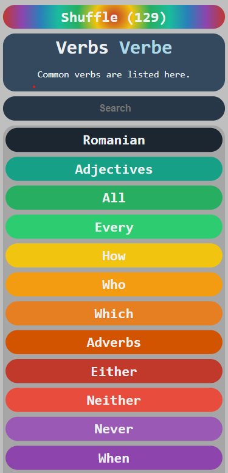

# languageTree
Create a personal tree of language. [Romanian language tree](https://dannyramasawmy.github.io/languageTree/)

## Description

This web-app uses a tree as its underlying data structure and implements algorithms to display, and search through the tree. 

The current page of the app will show the current node you are on, as well as it's parent and child nodes.  

## Install instructions
Nothing to install!

## Author:

Danny Ramasawmy

## Acknowledgments
- [Color schemes](https://htmlcolorcodes.com/)
- [Verb conjugation](https://cooljugator.com/ro/suna)
- [Special characters](https://www.thoughtco.com/html-codes-romanian-characters-4062226)
- [Icon](https://commons.wikimedia.org/wiki/File:Book-icon-bible.png)

## Screen shot

